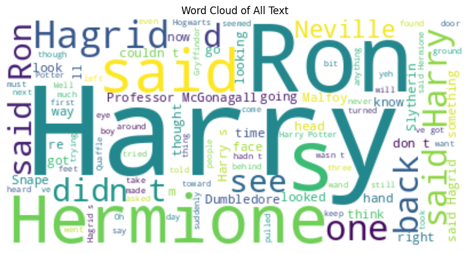

# Hogwarts House Classification from Harry Potter Texts

---

## Abstract
In the magical world of Harry Potter, characters are closely associated with their respective Hogwarts houses: **Gryffindor, Slytherin, Ravenclaw, and Hufflepuff**. This project aims to automatically classify characters into their houses based on textual evidence extracted from the books. Using **Named Entity Recognition (NER)**, we extract human names, process surrounding text, and train machine learning models on these samples. A **Random Forest classifier** was employed as the baseline, while an additional **Multilayer Perceptron (MLP)** was tested for comparison. Results show promising performance in aligning characters with their canonical houses, highlighting the potential of classical NLP and machine learning methods in literary analysis tasks.

---

## 1. Introduction
The Harry Potter series provides a rich textual dataset filled with characters, relationships, and houses. Each house has distinct traits, and many characters are explicitly or implicitly tied to one.  

The challenge is to build a system that, given a character’s name and textual context, predicts their Hogwarts house. This task tests the ability of **classical NLP pipelines and machine learning models** to handle named entities, context extraction, and classification.  

Our workflow can be summarized as follows:
1. Extract character names using **NER (Spacy transformer model)**.  
2. Build a dataset of sentences where each character appears.  
3. Assign labels (houses) to characters using a mapping dictionary.  
4. Train models (**Random Forest** and **MLP**) on contextual features extracted via **TF-IDF**.  
5. Evaluate and compare results with classification metrics.

---

## 2. Data Preparation

### 2.1 Named Entity Recognition (NER)
We used **spaCy (en_core_web_trf)** to extract all **PERSON** entities from *Harry Potter and the Sorcerer’s Stone*.  

### 2.2 Character–House Mapping
Since not all characters’ houses are explicitly mentioned in the text, we manually constructed a **dictionary of known characters** and their house affiliations (e.g., *Harry → Gryffindor*, *Draco Malfoy → Slytherin*).

### 2.3 Sentence Extraction
The raw text was split into sentences using regex. For each character, sentences containing their name were collected. A dataset was built in **DataFrame format** with three columns:
- `Character`  
- `House`  
- `Sentence`

### 2.4 Exploratory Data Analysis
To better understand the dataset, several analyses were performed:

- **House distribution**: Majority of samples belong to Gryffindor.
  

  

  
- **Character frequency**: *Harry Potter* appears most frequently.

  

  

- **Sentence length distribution**: Most sentences are relatively short.

    

  

- **Word cloud**: Visualizes the most common tokens, dominated by “Harry”.
  

  

- **Top 20 most common words**: Shows frequent mentions of main characters.
  

  

- **Character–House affiliation plots**: Cross-checking mapping consistency.
  

  

---

## 3. Methodology

### 3.1 Feature Engineering
We used **TF-IDF vectorization** with a maximum of 5000 features to transform sentences into numerical vectors suitable for machine learning.

### 3.2 Baseline Model: Random Forest
We trained a **Random Forest Classifier** with:
- `n_estimators = 100`  
- `random_state = 42`

Steps:
1. Split the dataset into **80% train** and **20% test**.  
2. Train the Random Forest on the training set.  
3. Evaluate predictions using classification metrics.

### 3.3 Extended Model: MLP Neural Network
As an additional experiment, we implemented a **Multilayer Perceptron (MLP)** in PyTorch:
- Input size = TF-IDF vector length.  
- 3 hidden layers: **512 → 128 → 32 neurons**.  
- Activation = ReLU.  
- Regularization = Dropout (0.2).  
- Optimizer = Adam (lr=0.001).  
- Loss function = CrossEntropyLoss.  
- Training epochs = 200.  

#### Handling Class Imbalance
Since some houses were underrepresented, we used **SMOTE (Synthetic Minority Oversampling Technique)** on the training set to balance class distributions.

---

## 4. Results

### 4.1 Random Forest Performance
The Random Forest model achieved solid baseline results, successfully predicting major houses with good precision and recall. Misclassifications occurred mostly between **Gryffindor and “other”**, given the dominance of Gryffindor in the dataset.

  

### 4.2 MLP Neural Network Performance
The MLP achieved:
- **Steady loss reduction** across 200 epochs.  
- Comparable accuracy to Random Forest, with potential for higher generalization on larger datasets.  

#### Classification Report

  

---

## 5. Conclusion
This work explored **house classification in Harry Potter** using classical NLP techniques and machine learning models. By combining **NER, TF-IDF features, and Random Forest classification**, we achieved effective results, with further improvements shown by an **MLP neural network**.  

This project demonstrates the potential of computational methods for **literary analysis**, opening doors for tasks like character relationship mapping, trait analysis, and automated story understanding.

---

## References
1. spaCy: Explosion AI – [https://spacy.io](https://spacy.io)  
2. Scikit-learn: Pedregosa et al., JMLR, 2011 – [https://scikit-learn.org](https://scikit-learn.org)  
3. fastText embeddings – [https://fasttext.cc](https://fasttext.cc)  
